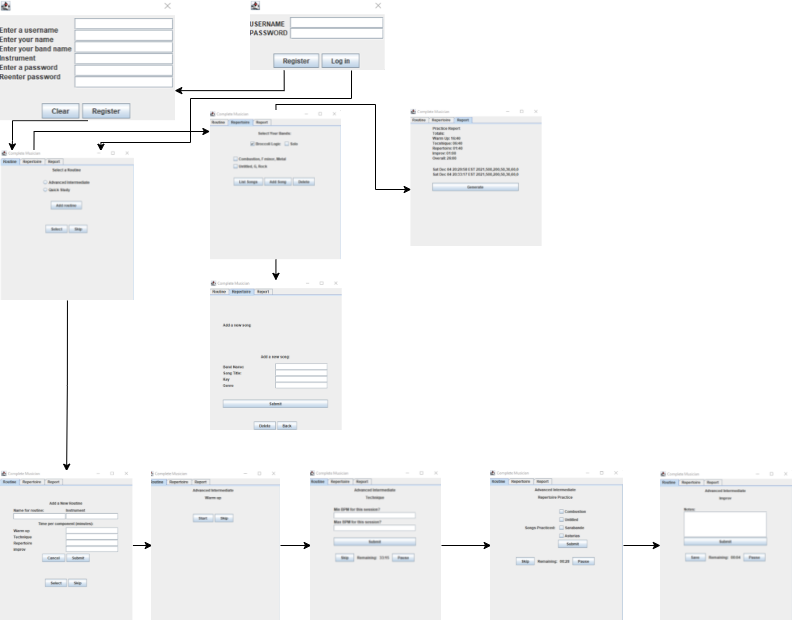

# Complete Musician App

**Instructions for running app:**
* Ensure you have Java Runtime Environment (JRE) installed on your computer https://www.oracle.com/java/technologies/downloads/#jdk17-windows
* download all files to the same directory and type the command: make run
* note: Windows will require the prior installation of a make program, such as chocolatey https://chocolatey.org/install

**Overview**

This app is a system for musicians to create, organize, and log their practice routines to ensure that they are spending the necessary time on each skill (improvisation, practicing songs, technique, etc.) to advance as a well-rounded musician. The user will also be able to log their repertoire, or the songs that they are able to play (multiple repertoires are common for different groups and settings, instruments, etc.), and store certain information during each comopnent segment that will be saved for reporting. It is all too common to meet musicians who spend all day studying only technique and song fragments and cannot play you any songs when you ask. Or the opposite, and they have been playing the same easy song for years. This system is intended for a musician to be able to log and analyze the most important components of being as successful as they can at what they do.

**User Class**

The user class will be an object that represents the musician. This object will be made up of at least one practice routine, one or more repertoires, and a compilation of session objects. This object will allow the user to view metrics and logs.

**Routine Class**

The routine class will represent the user’s practice routine. Each routine will have an instrument, nickname, and a compilation of components that represent each skill-based segment of the routine.

**Component Classes**

The component class will be abstract and be where it is established that each component will have a duration, a unique panel for recording component-specific information in a session,  and an elapsed time. Furthermore, they will allow the user to start, pause, or skip a component at any point. Once the component has been skipped, the amount of time spent on that particular component will be logged for the session.

The Warmup component will be an implementation of the abstract component class that logs the time recorded as warming up.

The technique component will allow the user to enter details about their fastest tempo in BPM logged while using the metronome, as well as the slowest. While playing slow is not a skill, never slowing down to work on cleaning up technique leads to sloppy playing.

The songPractice component will allow the user to log the songs that they work on in a particular session and track the practice time for each of them. 

The improvisation component will allow the user to enter notes about the segment after they finish. It is important to keep notes such as keys, tempos, creative ideas, etc. to make sure that each improvisation session is unique and fruitful.

**Repertoire Class**

A musician’s repertoire is a collection of the songs that they are able to perform (or working on being able to perform). This class will allow the user to label it with an instrument and band, and songs can be or added, removed.

**Song class**

This class represents the individual songs that make up the musican’s repertoire. It will store data song title, key, and genre. It will take time spent and last played data from a songPractice component of the routine class to keep a running total of hours and days spent on each song. 

**Session Class**

The session class will include the data about each practice session. These sessions will be aggregated and stored in the user object, then written and loaded each time the user saves and reopens the app.

**Report Class**

The report class will contain a user and will be responsible for turning data from aggregated sessions attached to this user into values that can be displayed to the user in the form of a dashboard.

**Countdown Class**

The countdown class will create the timer that will be displayed on the screen when the user is working through their routine. It will be used to calculate and return how much time elapsed when the user moves forward to the next component of their session.

**Loader Class**

The loader class will contain static methods used to load all data from the files upon successful login, and to populate the user object with this data.

**Anticipated Use Cases**

The app will be primarily designed for the use case of a musician being able to track and review their practice sessions to stay on track and have more fruitful practice sessions. A possible extension is to create an instructor login class for where instructor could be assigned to different students and be able to access their routines and repertoires and create notes for the user to read. An admin user woudl also be necessary at this point. A personal notes section could be implemented that would not be viewable to the instructor in this case. A journaling component could be added, where musicians can log their ideas on their playing, composition ideas, and notes from lessons.

## Graphical User Interface

## UML Diagram

 

## Use of Object-Oriented Programming Concepts

The design of this project is well-suited for object-oriented programming, including over 16 total classes, with four stemming from abstract classes

·     **Inheritance** – The WarmUp, Technique, SongPractice, and Improv classes all inherit from the Component class

·     **Encapsulation** – All data members are protected and can only be accessed with object methods

·     **Polymorphism –** The component subclasses all have overridden classes that return unique JPanels added to the GUI

·     **Abstraction –** The component class is abstract

·     **Aggregation –** The Session, User, Repertoire, and Song classes all have aggregation relationships

·     **Composition –** The routine is made up of many component objects, and the repertoire of song objects

Extensive use of all of these concepts can also be seen in the implementation of Java Swing

## Use of Data Structures

The use of ArrayLists is very common throughout this project, with dozens of examples suh as the aggregations of Routine, Repertoire, and Sessions objects that are assigned to the user object. Furthermore, abstract data classes were also implemented in the form of user-created LinkedLists of strings, Songs objects, and User objects. Custom methods were created to facilitate needs that are specific to this program, such as the login system and accessing and organizing Song-object data.

## Algorithm

### User Class Methods:

getters and setters

**setSelectedRoutineByName():**

Input: String

cycle through the routines attached to the user

compare each routine nickName attribute to the string input

if there is a match, set the selected routine attribute equal to the routine with the match

**addSongPanel():**

input: none

outputL JPanel

Add labels, textfields, panels, and layouts as seen in GUI design above for Add Songs panel

create a submit button that:

	1. Checks to ensure no fields are empty
	2. Check to see that there is a repertoire under the band name that was entered using getRepertoireByBand() method
	3. Displays an error if no repertoire exists for the band that was entered in the field
	4. Otherwise adds the song to the user's corresponding repertoire with the information from the fields
	5. write the data to the user's files
	6. display a message that says the song was added
	7. clear the panel

return this panel

**addRoutinePanel()**

input: none

output: JPanel

Add labels, textfields, panels, and layouts as seen in GUI design above for Add Routines panel

create a cancel button to:

1. remove all from panel
2. add the panel returned from the getSelectedRoutine() method to the current panel

Create a sumit button to:

​	1. Check to ensure that no fields are empty

​	2. Create new Routine, Warmup, Technique, songPractice, and Improv objects with values from the fields

​	3. Add each of the components (all new objects aside from Routine) to a new ArrayList

4. Attach this ArrayList of components to the new Routine object using the setComponents() method

5. clear all contents in the subpanels

return this panel

**getSelectRoutinePanel()**

input: none

output: JPanel

Create an empty ArrayList called routineNames

Add labels, textfields, panels, and layouts as seen in GUI design above for Get Selected Routine panel

If the user has at least one routine 

1. for each routine that the user has:
   * if the routineNames arrayList does not contain this routine nickname, add this routine nickname to the routine names arraylist
2. iterate over routines attached to user
   * add a string with the value of i and a radio button with the routine name for this routine
   * add these buttons to panel
3. iterate over radio buttons
   * add radio button to a button group
   * add radio button to panel

Add an addRoutineButton that:

1. removes content from current panel
2. adds panel returned from getRoutinePanel() method to current panel

Add event listeners to each radio button

1. For each radio button in the Arraylist
   	* if the button is selected, set the selected routine using setSelectedRoutine(String) method and passing it the text of the radio button

Add a select button that:

1. Sets routineName variable equal to an empty string
2. itereate through ArrayList of radio buttons
   * if button is selected, set routine name equal to the ArrayList of String names with the same index
   * if the routine name is not null
   * set the selected routine by name using setSelectedRoutine(String) method
3. Remove content from subpanels
4. Reset and add the title with the selected routine name

return this panel

**getRepertoireByBandName()**

input: String

1. for each repertoire attached to this object
   * if the band name of the repertoire equals the string passed into this method, return said repertoire
   * otherwise, return null

**writeStats()**

input: none

output: _routines.txt, _components.txt, _repertoires.txt, _songs.txt, _sessions.txt

create a new file writer for each file to be written

loop through all of the corresponding objects and call their getPayload() methods to write this text

flush and close the writer

### Repertoire Class Methods

constructors, getters, and setters

getPayload()

### Song Class Methods

constructors, getters, and setters

getPayLoad()

getWritePayLoad():

​	return a string with attributes in String format as needed to be written to user's files for storage

### Routine Class Methods

constructors, getters, and setters

getPayload

### Abstract Class Component Methods

getters and setters

abstract getPanel(): method

input: User object

output: Jpanel

### WarmUp Class Methods

cosntructors, getters, and setters

getPanel returns an empty JPanel in this case, as no content needs to be logged while warming up

### Technique Class Methods

constructors, getters, and setters

**getPanel OVERRIDE:**

Create a panel with a form that accepts minBPM and maxBPM values entered by the user

Create a submit button that sets these attributes with this data by calling setters if fields are complete and integer values

return this panel

### SongPractice Class Methods

constructors, getters, and setters

**getPanel OVERRIDE:**

If the user has a repertoire:

*  loop through each of them and get an array of song anmes using the getNames() method in LLSong

  iterate over this array of song names:

  	* Create a new checkbox with the song name as text
  	* add this checkbox to a panel
  	* add the checkbox to an arrayList of checkboxes

Create and add layout

add a submit button that:

1. iterates through each checkbox in this arrayList of checkboxes
2. if the checkbox is selected, create a new linkedList of strings
3.  apend the song name to the linkedList
4. set songsPracticed attribute of this class using this LinkedList value

return this panel

### Improv Class Methods

constructor, getters, and setters

getPanel OVERRIDE:

Create a panel with a textArea for notes and a submit button

When the submit button is clicked, set the notes attribute with the content of the notes textField

return this panel

### Loader Class Methods (all are static)

**readFile():**

input: String filename

1. create a string builder to hold the file data
2. try to open the file
3. make a new file object
4. create a scanner instance to read the file

5. read and parse the file by line breaks

6. append each line to the string builder

7. close the reader

8. if no file is found, throw an excepition

9. otherwise, convert string builder content to string and return this value

**appendUser():**

input:

String username, String password, String name

1. create a new filewriter to append to usersInput.txt

2. write username and password to file
3. clear and close the writer

**loadUsers():**

creates a LinkedList of user objects using data from file containing registered user info

input: usersInput.txt

output: LLUser object

1. create an array where each element is a line in the string returned from the file
2. iterate through each comma separated value
3. store each array item as an attribute name for the object
4. add user to a LinkedList
5. return the LinkedList of users

**loadSession():**

input: User 

output: User

loads the information for a single user and creates objects with content from files

1. call loadComponents(), loadRoutines(), loadRepertoires(), and loadSessionHistory()
2. return the resulting user

**loadSessionHistory():**

input: User

output: User

loads the data from prior sessions and create corresponding objects, then attach to user

1. read data from user's sessions file and store in an array of data parsed by line break
2. initialize an arraylist of session objects
3. if there is content in this file:
   1. for each element in the data array
      1. split the element by comma and return an array
      2. store the attributes for each session object
      3. create a new session using these stored values
   2. attach these sessions to user
   3. return the user
4. if there is no content, return null

**loadComponents():**

input: User

output: User

load the data from components file and create corresponding objects, add to an ArrayList, and return

1. read data from user's components file and store in an array of data parsed by line break
2. if there is content in the file
   1. initialize an arraylist of component objects
   2. for each element in the data array
   3. split the element by comma and return an array
   4. store the attributes for each session object
   5. create different class of component depending on type of component
   6. append to arrayList of components
   7. return ArrayList of components
3. if there is no content in file, return null

**loadRoutuines():**

input: User

output: User

load the data from routine file and create corresponding objects, then attach to user

1. read data from user's components file and store in an array of data parsed by line break
2. if there is content in the file
   1. get components for this user
   2. initialize an arraylist of grouped components
   3. initialize an arraylist of routine objects
   4. iterate through data array
      1. split and store attributes as variables
      2. create a new routine using attributes
      3. add routines to ArrayList of routines
   5. for each routine in the array list of routines
      1. wipe groupedComponents ArrayList
      2. for each of the four types of components
         1. add component to groupedComponent ArrayLists
      3. attach these components to the routine
   6. attach routine to user
   7. return this user
3. if there is no content in file, return null

**loadSongs():**

input: User

output: LLSong

loads data from songs file for user and creates and returns a LinkedList of songs

1. read and parse data in songs file into an array by line break delimiter
2. if there is content in the file
   1. crete a new LinkedList of song objects
   2. iterate through items in data array
      1. parse by comma and split into array values
      2. store corresponding array values as attribute variables for song object
      3. append a new song with these attributes
      4. return resultant LLSong object
3. return null if file is empty

**loadRepertoires():**

input: User

output: User

load the data from a user's repertoire file and attach them to a user, then return user

1. read data from repertoires file and split into an array of data by newline delimiter

2. if there is content in the file
   1. get the songs for this user
   2. create an arraylist of repertoire
   3. iterate through data array
      1. split into an array using comma delimiter
      2. store attributes from file as variables
      3. create a new repertoire
      4. if this repertoire has songs, add them to it
      5. add only songs that correspond to the band associated with this repertoire using findAllByBand method
      6. add repertoires to repertoire list
   4. set user repertoires equal to this list
   5. return user object
3. return null if file is empty

### Session Class Methods:

constructors, getters, setters

setNewSession():

initializes attributes using data from components

1. get component values using get component on components attribute and store each one in corresponding attributes for this object

### Report Class methods

constructors, getters, setters

**setPracticeTimes**():

determine and set practice times using info from the user

1. initialize variables to hold values for each attribute
2. for each session in this report
   1. store a running sum of the elapsed time values for each component

3. set these attributes equal to the sums
4. set the total practice time equal to the sum of the above items

### Countdown Class Methods

constructor, getters, and setters

**constructor**():

input: User, Component

1. make panel visible
2. add label for timer
3. add label to panel
4. calculate remaining time for component
5. set up the timer to do the following ecery second
   1. set text of jlabel equal to calculated remaining time
   2. subtract 1 from remaining
   3. if time is up
      1. end timer
      2. set final text for JLabel

### Login Dialog Class methods

class extends JDialog

1. set labels and fields for dialog
2. **constructor**:
   1. make visible
   2. create panel layout and add components
   3. if closed, delete object
   4. if window is closed, end program
   5. create a login button that will:
      1. load users from user file
      2. get username and password from panel fields and call login method with these values
      3. if this method returns a value that is not null
         1. make dialog invisible
         2. load the values into this user for the session
         3. load the tabbed pane for this user
      4. otherwise: if user info returned null, print Invalid Credentials
3. Add a register button that creates a new RegisterDialog object and makes this LoginDialog not visible anymore

### Register Dialog Class Methods

class extends JDialog

1. create labels and fields to go in dialog

2. **constructor**:

   1. make panel visible
   2. set up layout
   3. set to delete and end program on close
   4. make a register button that will:
      1. Check to ensure password fields match and display a message otherwise
      2. if any fields are null, print a message stating that all fields are required
      3. otherwise: append the user info the registered users file
      4. create all files for this new user
      5. load all users
      6. store user as results from login method
      7. if returned user object is not null, set visible equal to false and set user equal to the returned value of calling the Loader.loadSession method on the current user
      8. create a new simpleTabbedPane using the user

   **createFiles**():

   input: String username, String instrument, String band

   1. creates files to store data for user using FileWriter objects
   2. use instrument and band data from form and write to repertoire file so that the user is initialized with at least one repertoire

### SimpleTabbedPane Class methods

class extends JFrame

**Constructor**:

 	1. set user and add title to tabbed pane
 	2. exit program if window is closed
 	3. create new JTabbedPane with tabs on top
 	4. create routine, repertoire, and report panels, set size, and make visible
 	5. add tabs to content pane

### RoutinePanel Class methods

class extends JPanel

add buttons and labels

ArrayList sessionComponents to hold components for this session

create a ButtonGroup radioButtonMap for radio buttons

create an ArrayList routines for routines

create a Hashmap to hold radio buttons and string labels

create a Countdown timer object

create a Component object to store the component that is active at a particular time

create a session object for this practice session

create a counter

constructor:

 	1. set user
 	2. set sixe of panel
 	3. call initializePanel()  method

**getSelectedRoutineName():**

input: none

output: String routineName

1. initialize routine name String variable
2. iterate through routines
3. if the radioButton in the hashmap for this routine is selected, set the routine name equal to the one at this index
4. return routineName

**setSelectedRoutine**():

input: String routineName

 	1. for each routine attached to the user
 	  	1. if the nickname of the routine is equal to routineName value passed into function
 	       	1. set the selectedRoutine for the user equal to said routine
 	2. set the selectedComponent equal to the selected routine component with the index of the counter

**startCountdown():**

input: none

output: Countdown

1. creates new countdown with user and selected component parameters
2. return this countdown object

**pauseTimer():**

1. set the elapsed time of the selected component equal to the duration of the selected component minus the remaining time
2. create and return a new JLabel with text value of remaining time in MM:SS format

**updateTime():**

input: none

output: JLabel

​	create and return a new JLabel with text value of remaining time in MM:SS format

**refresh():**

	1. call invalidate() validate() repaint() to refresh panel content

**moveToNextComponent():**

selects next component in user's selected routine

1. if the counter is less than 3
   1. increment counter by 1
   2. set selected component equal to the component in the user's Arraylist of selected routines with the index of i
2. otherwise save the session by calling saveSession():

**saveSession**():

Saves information about practice session

1. create an arraylist of Sessions attached to the user
2. add a new session with these components as a parameter
3. set the user's sessions attribute equal to the currentSessions ArrayList
4. write user data by calling user.writeStats()
5. reset counter

**initialize**():

starts the initial panel

1. create panels and layout and add
2. create <u>select</u> button that will do:
   1. if the user has selected a routine radio button
   2. call getSelectedRoutineName() and setSelectedRoutine() using returned value
   3. remove all content from panels
   4. set title and add to p1
   5. add componentName to P1
   6. add start and skip buttons to 03
   7. call refresh()
3. create a start button that will:
   1. get and set text for selectedCompoenent JLabel
   2. if the component name is 'improv' (final component)
      1. add a save button
   3. otherwise add a skip button
   4. add the countdown to p3
   5. remove start button
   6. add pause button to p3
   7. refresh panel content
4. create a skip button that will:
   1. update elapsed time for component by calling updateTime and passing in the remaining time attribute from the countdown object
   2. delete the timer
   3. remove items from panels
   4. add selectedComponent to sessionComponents
   5. try to move to the next component
   6. set text for selectedComponent with getter and setter
   7. add component name
   8. add unique panel for current component by using calling getPanel method for the selected component and adding the returned panel
   9. add a start button
   10. refresh
5. create a pause button that will:
   1. remove countdown and pause button
   2. add JLabel with remaining time to display frozen time
   3. pause the timer by calling the pauseTimer method
   4. add a start button
   5. refresh panel
6. create a save button that will:
   1. remove all content from subpanels
   2. add the selectedComponent object to the sessionComponents ArrayList
   3. try to save the session by calling saveSession() method
   4. indicate that the session was saved on panel
   5. refresh

return this panel

### Repertoire Object Methods

object extends JPanel

create an arraylist to hold band names band

create a hashmap to hold checkboxes and string values checkBoxMap

create an arraylist to hold selected repertoire objects selectedRepertoires

array list to hold checkboxes for songs songCheckboxes

create labels and buttons

**constructor():**

1. create buttons, labels, and panels

2. add content to panel

3. create an addSong button that will.

   1. remove all items from p1 and p2
   2. remove checkBoxesPanel
   3. add label to panel 1
   4. call addSong() and add the returned panel
   5. remove addSong button
   6. remove list button
   7. add backButton p3
   8. try to write stats
   9. refresh

4. create a back button that will:

   1. remove all items from p1 and p2
   2. remove back button from p3
   3. add listSongsButton
   4. add addSong button
   5. remove delete button and checkboxes panel with songs
   6. refresh

5. create a listSongs button that will

   1. remove all content from p2
   2. set selected repertories using setSelectedRepertoires() method
   3. if at least one repertpore is selected
      1. set checkBoxesPanel equal to the results from the printSongs() method and add this panel
      2. add a delete button
   4. otherwise, remove delete button and any previously listed songs (checkBoxPanel)

   5. refresh

6. create a delete button that will

   1. call the deleteSongs() method
   2. call the updaetUser method
   3. remove all from p2
   4. set selected repertoire by calling setSelectedRepertoire
   5. refresh panel
   6. if selectedRepertoires contains more than one item, repertoire is selected, so print items
      1. call printSongsPanel
      2. add to center
      3. add delete btton to p2
   7. otherwise, remove delete button and remove checkBoxesPanel of listed songs
   8. refresh

7. create a save button that will:
   1. write user data by calling user.writeStats();
   2. remove save button
   3. remove all from p1
   4. add a jlabel indicating that song was saved

**deleteSongs():**

 	1. for each JCheckbox in songCheckBoxes
 	  	1. if this checkbox is selected
 	       	1. for each repertoire attached to the user
 	       	2. if selected song corresponding to JCheckbox exists in said repertoire
 	            	1. delete this song from said repertoire by calling deleteSong method in LLSong

write user stats to files

**getBandCheckboxPanel():**

create a new JPanel

if the user has a repertoire

	1. for each one that they have
	2. if the arraylist of bands does not contain this band name
	3. add it to the list of band names
	4. iterate through user repertoires
	  	1. put a string with the value of i and checkbox with the band name in the checkbox hashmap
	5. iterate through hashmap
	  	1. add checkbox to the panel using the key value of i as an identifier

return panel

**setSelectedRepertoires():**

set which repertoires are selected

1. create an array list of repertoire objects
2. for each JCheckbox in the checkBoxMap
   1. if said checkbox is selected
   2. get the repertoire associated with this band from the user object and add it to the List
3. set selectedRepertoires equal to repertoires List

**printSongs():**

input: none

output: JPanel

1. create a new panel with 1 col and infinite rows
2. for each repertoire in selectedRepertoires
   1. get the LLsong of objects for said repertoire and store them in a linked list
   2. get the song checkboxes for this LinkedList of songs by calling getSongCheckBoxes in LLSong
   3. add each of these checkboxes to p1 and refresh

3. create panel and layout and return panel

**addSong():**

1. create a new JPanel
2. get and add the addSong panel for this user to the panel
3. return this panel

### ReportPanel Class Methods:

class extends JPanel

**constructor**:

 1. set User

 2. create stringBuilder for appending text

 3. Create buttons, labels, panels, and layout

 4. create a generate button that will:

     	1. remoev all from p2
          	2. add JPanel returned from calling getSessionPanel to p2
          	3. remove all from p1
          	4. add title to p1
          	5. add time totals and itemized practice data to panel
          	6. refresh content

 5. **getSessionPanel():**

    input: none

    output: JPanel

    1. create new reporting and pass this user into constructor
    2. create an arraylist of JLabels for sessions data
    3. for each session in this report object
       1. add a new JLabel to sessionsData list with the session payload as text
    4. create a new panel with infinite rows and 1 col
    5. for each Jlabel in sessionsData list
       1. add said label to the panel
    6. return this panel

